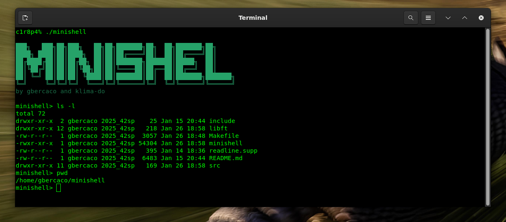

*This project has been created as part of the 42 curriculum by gbercaco and klima-do.*



# Minishell

A minimalist shell implementation in C, capable of interpreting and executing Unix commands similar to bash.

## Description

Minishell is an educational project that implements a functional Unix shell in C. The project demonstrates deep knowledge of:
- Command line tokenization and parsing
- Abstract Syntax Trees (AST) for command representation
- Pipes and redirections
- Signals and processes (fork/exec)
- Environment variables
- Built-in commands

## Key Features

### Shell Functionality
- **Pipes**: Support for `|` (process pipelines)
- **Logical operators**: `&&` (AND) and `||` (OR)
- **Redirections**:
  - `>` - standard output to file
  - `>>` - append to file
  - `<` - standard input from file
  - `<<` - heredoc
- **Variable expansion**: Replaces `$VAR` with environment values
- **History**: Maintains command history (readline)
- **Quotes**: Support for single and double quotes

### Built-in Commands
- `cd` - change directory
- `pwd` - current directory path
- `echo` - display text
- `env` - display environment variables
- `export` - set environment variables
- `unset` - remove environment variables
- `exit` - exit the shell

### Signals
- Ctrl+C (`SIGINT`) - interrupts running command
- Ctrl+D (`EOF`) - exits the shell
- Ctrl+\\ (`SIGQUIT`) - no effect (as in interactive bash)

## Project Structure

```
minishell/
├── src/                    # Main source code
│   ├── main.c              # Entry point and main loop
│   ├── builtins/           # Built-in command implementations
│   ├── execute/            # Command and pipe execution
│   ├── expansions/         # Variable expansion
│   ├── parser/             # Parser and AST
│   ├── redirections/       # Redirection handling
│   ├── signals/            # Signal handling
│   ├── token/              # Tokenization
│   ├── env/                # Environment management
│   └── utils/              # Utility functions
├── include/                # Headers
│   └── minishell.h         # Main definitions
├── libft/                  # Custom library (libft)
│   ├── strings/            # String functions
│   ├── memory/             # Memory functions
│   ├── list/               # Linked list structure
│   ├── hash/               # Hash table for environment
│   ├── number/             # Number functions
│   ├── print/              # Print functions
│   └── ...
└── Makefile                # Build system

```

## Compilation

### Requirements
- GCC or Clang
- Make
- Readline library (usually pre-installed on Linux/macOS)

### Build Instructions

```bash
# Compile the project
make

# Clean object files
make clean

# Clean everything (including executable)
make fclean

# Rebuild from scratch
make re
```

## Usage

```bash
# Run the shell
./minishell

# Command examples
minishell> ls -la
minishell> echo "Hello World"
minishell> pwd
minishell> cd src
minishell> ls | grep main
minishell> cat file.txt > output.txt
minishell> grep "pattern" input.txt | wc -l
minishell> export VAR=value
minishell> $VAR
minishell> exit
```

## Architecture

### Execution Flow

1. **Tokenization** (`src/token/tokenizer.c`)
   - Reads input line
   - Splits into tokens (words, operators, redirections)
   - Maintains quoting information (single/double)

2. **Parsing** (`src/parser/parse_ast.c`)
   - Builds an Abstract Syntax Tree (AST)
   - Groups commands by pipes, AND, OR
   - Associates redirections to commands

3. **Expansion** (`src/expansions/expansions.c`)
   - Expands environment variables (`$VAR`)
   - Processes quotes

4. **Execution** (`src/execute/execute.c`)
   - Traverses the AST
   - Executes built-ins or creates processes (fork/exec)
   - Manages pipes and redirections
   - Waits for child processes

### Main Data Structures

```c
// Token - tokenization result
typedef struct s_token {
    char *value;
    t_toktype type;
    int single_quoted;
    struct s_token *next;
} t_token;

// AST Node - syntax tree node
typedef struct s_ast {
    t_node_type type;
    t_token *token;
    t_command *cmd;
    struct s_ast *left;
    struct s_ast *right;
} t_ast;

// Command with arguments and redirections
typedef struct s_command {
    char **argv;
    char *infile;
    char *outfile;
    int append;
    int heredoc;
    int *quoted;
    int argc;
    struct s_command *next;
} t_command;

// Shell - global state
typedef struct t_shell {
    t_hash *env;
    char *input;
    int last_status;
    int should_exit;
    int exit_status;
} t_shell;
```

## Special Variables

- `$?` - Exit status of the last command
- `$PATH` - Path to search for executables
- `$HOME` - User's home directory
- `$PWD` - Current working directory
- Other environment variables can be accessed normally

## Limitations

- No wildcards (`*`, `?`, etc.)
- No job control
- No aliases
- No history expansion
- Simple redirections (no `&>`, `2>`, etc.)

## Testing

```bash
# Run tests
./test.sh

# Or test manually
./minishell
minishell> ls -la
minishell> echo test | cat
minishell> exit
```

## Resources

### Documentation and References
- [Bash Manual](https://www.gnu.org/software/bash/manual/) - Official GNU Bash manual
- [POSIX Shell Standard](https://pubs.opengroup.org/onlinepubs/9699919799/utilities/V3_chap02.html) - Standard for shell behavior
- [Linux man pages - execve](https://man7.org/linux/man-pages/man2/execve.2.html) - Process execution
- [Linux man pages - fork](https://man7.org/linux/man-pages/man2/fork.2.html) - Process creation
- [Linux man pages - pipe](https://man7.org/linux/man-pages/man2/pipe.2.html) - Inter-process communication
- [Linux man pages - signal](https://man7.org/linux/man-pages/man7/signal.7.html) - Signal handling

### AI Usage

AI was used to generate the initial structure and documentation of this README file. Specifically:
- **README structure and organization**: Generated the overall layout, sections, and formatting to provide comprehensive project documentation
- **Documentation writing**: Created clear descriptions of features, architecture, and usage examples
- **Content organization**: Structured the information for maximum clarity and accessibility to new users

The actual implementation and source code were developed independently following the 42 School curriculum requirements.
